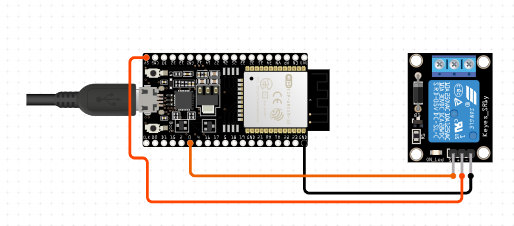

# ESP32 Relay Control with MQTT

This project demonstrates how to control a relay using an ESP32 microcontroller and MQTT messaging protocol. It allows you to remotely turn on or off a connected electrical device through an MQTT broker.

## Hardware Requirements

- ESP32 microcontroller
- Relay module
- LED (optional, for visual indication)
- WiFi connection for ESP32

## Schematics



## Software Dependencies

- [Arduino IDE](https://www.arduino.cc/en/software)
- Libraries:
  - [WiFi](https://www.arduino.cc/en/Reference/WiFi) - for connecting to the WiFi network
  - [PubSubClient](https://pubsubclient.knolleary.net/) - for MQTT communication

## Installation and Setup

1. Clone or download this repository.
2. Open the project in the Arduino IDE.
3. Install the required libraries through the Arduino Library Manager if not already installed.
4. Update the following parameters in the code:
   - WiFi SSID and password
   - MQTT broker details (server, port, username, password, topic)
   - Relay pin number
5. Connect the relay module and LED to the ESP32 as per the pin configurations in the code.
6. Compile and upload the code to your ESP32 board.

## Homeassistant Setup

```
mqtt:
  switch:
    - name: "Switch 1" # Choose an easy-to-recognize name
      state_topic: "home/electrical/relay1/get" # Topic to read the current state
      command_topic: "home/electrical/relay1/set" # Topic to publish commands
      qos: 1
      payload_on: 0 # or "on", depending on your MQTT device
      payload_off: 1 # or "off", depending on your MQTT device
      retain: true # or false if you want to wait for changes
```

## Usage

1. Once uploaded, the ESP32 will connect to the specified WiFi network and MQTT broker.
2. It will subscribe to the specified MQTT topic for receiving control commands.
3. You can send MQTT messages with payload `1` to turn off the relay or `0` to turn on the relay.
4. The ESP32 will respond accordingly by controlling the relay and updating the relay status on a designated MQTT topic.

## Notes

- Ensure that your MQTT broker is correctly configured and accessible from the ESP32.
- Make sure to provide adequate power to the relay module, especially if controlling high-power devices.
- Consider implementing security measures such as TLS encryption and authentication for MQTT communication in production environments.

## Contributing

Contributions are welcome! If you find any issues or have suggestions for improvements, please open an issue or submit a pull request.

## License

This project is licensed under the MIT License - see the [LICENSE](LICENSE) file for details.# HomeassistantRelay
ESP32 Relay Control with MQTT
